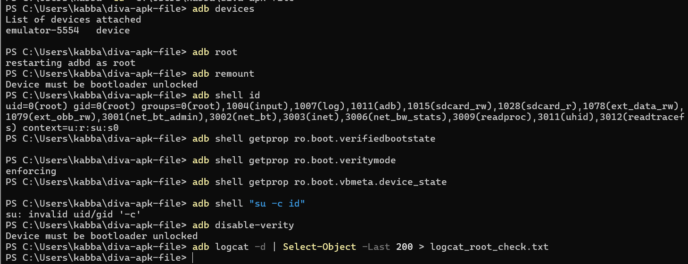
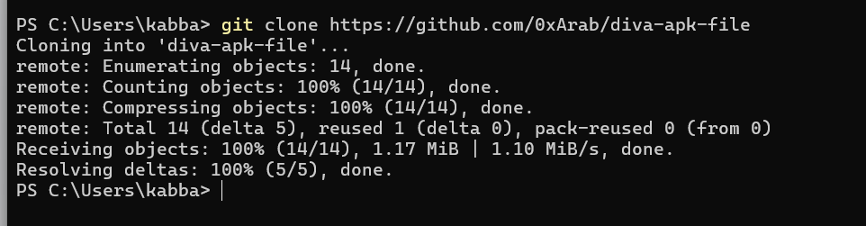
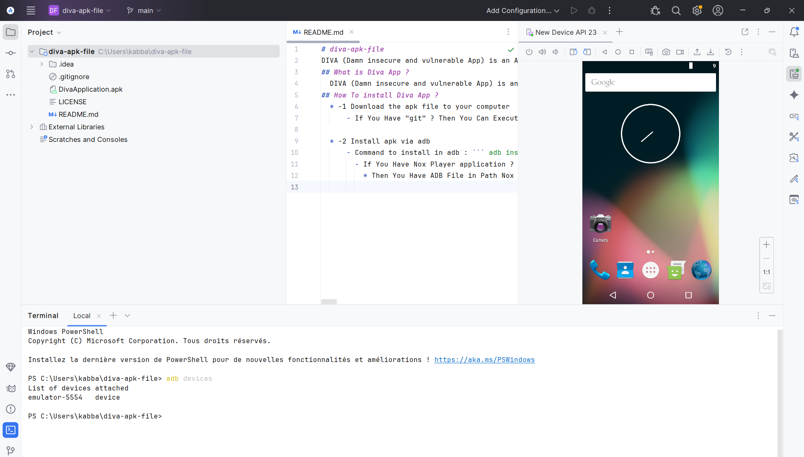
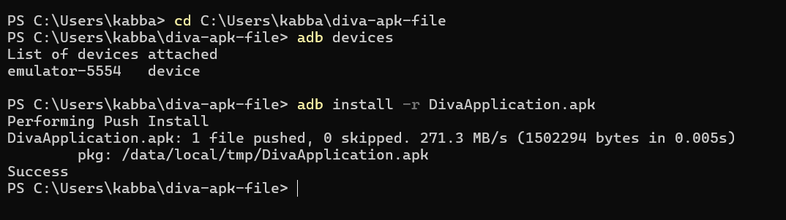
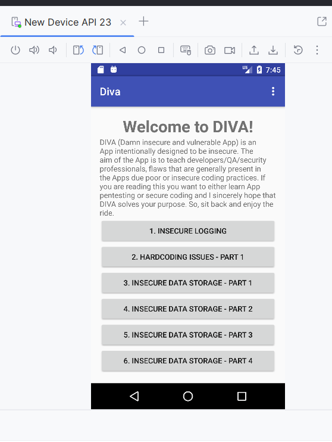
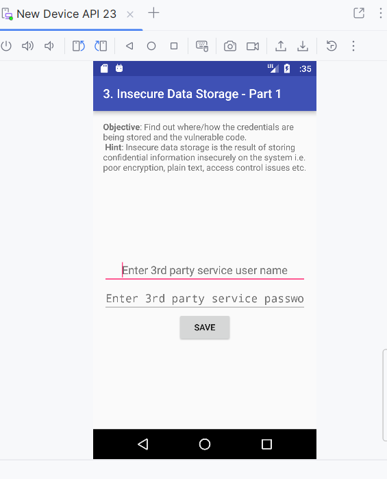
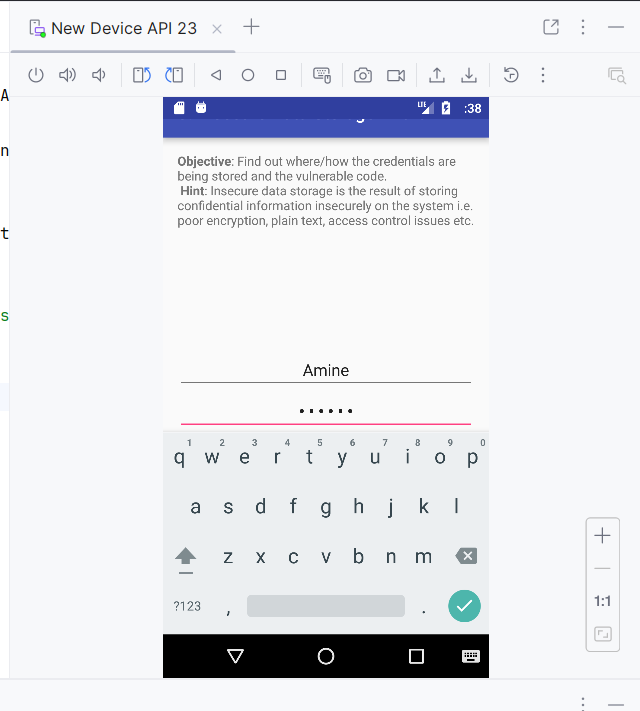
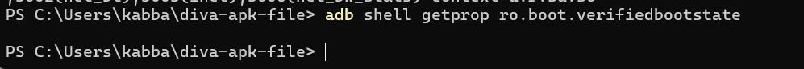

# Lab2: Android Rooting
## Objectif
Réaliser un laboratoire de sécurité Android afin de comprendre :
- le rooting,
- Verified Boot / AVB,
- les impacts sécurité.
## Environnement
- Android Studio
- AVD (API 23)
- ADB
## Étape 1 : Rooter l’AVD

L’émulateur Android (AVD) a été détecté correctement par ADB.  La commande `adb root` permet de redémarrer le service ADB avec des privilèges élevés, ce qui est autorisé uniquement sur les images d’émulateur ou de laboratoire.  La commande `adb shell id` retourne `uid=0 (root)`, confirmant que l’environnement est bien rooté.  Cela permet d’accéder à des zones normalement protégées du système afin d’observer l’impact du root sur les mécanismes de sécurité Android etla commande `fastboot oem device-info` n’est applicable que sur un appareil physique connecté en mode fastboot avec un bootloader déverrouillé.  
## Étape 2 : Fiche périmètre
- Application : App de test (debug)
- Support : Android Virtual Device (AVD)
- Objectif : Comprendre le rooting et ses impacts
- Données : Fictives uniquement
- Réseau : Environnement de test isolé
## Étape 4 : Installons et lancons l'app de test

Cette capture montre le clonage réussi du dépôt GitHub contenant l’application DIVA à l’aide de la commande `git clone`.  
Le dépôt a été récupéré localement afin d’installer l’application de test dans un environnement contrôlé.

Cette capture montre le projet DIVA ouvert dans Android Studio ainsi que l’émulateur Android (AVD) démarré.  

Cette capture montre l’installation réussie de l’application DIVA sur l’AVD à l’aide de la commande `adb install`.Le message `Success` confirme que l’application a été correctement déployée dans l’environnement de test.
## Étape 5 : Définition de scénarios simples

### Scénario 1 – Ouverture de l’écran d’accueil de DIVA

Cette capture montre l’écran d’accueil de l’application DIVA après son lancement sur l’AVD.Elle confirme que l’application démarre correctement et affiche la liste des modules de test disponibles. 
### Scénario 2 – Acceptation d’une entrée utilisateur non validée

Une entrée utilisateur inattendue a été saisie dans le champ de nom d’utilisateur du module « Insecure Data Storage – Part 1 ». L’application accepte la valeur sans afficher de message d’erreur et confirme l’enregistrement des données.Ce comportement indique une absence de validation ou de filtrage des entrées utilisateur avant leur stockage.  
### Scénario 3 – Interaction utilisateur et sauvegarde de données

Cette capture illustre une interaction utilisateur dans le module « Insecure Data Storage – Part 1 ».Un identifiant et un mot de passe fictifs sont saisis puis enregistrés via l’action « SAVE ».
## Étape 6 : Résumé Android Security
Android repose sur un modèle de sécurité en couches et chaque application est isolée via le sandboxing.Le modèle de permissions contrôle l'accès aux ressources sensibles et Verified Boot protège l’intégrité du système au démarrage puis le rooting affaiblit ces protections.
## Étape 7 : Verified Boot

### Objectif principal de Verified Boot
Verified Boot a pour objectif de garantir que le système Android qui démarre est celui prévu par le fabricant, sans modifications malveillantes.

### Définition de la "chain of trust"
La chaîne de confiance est une série de vérifications où chaque composant du processus de démarrage vérifie l’authenticité du composant suivant avant de lui faire confiance.  
Si un maillon est compromis, le démarrage est signalé comme non fiable.

### Importance de l’intégrité au démarrage
L’intégrité au démarrage est critique car si le processus de démarrage est compromis, toutes les protections de sécurité ultérieures peuvent être contournées, comme une forteresse dont la porte principale serait ouverte.
### Vérification de l’état de Verified Boot sur l’AVD

Cette capture montre l’exécution de la commande `adb shell getprop ro.boot.verifiedbootstate` sur un Android Virtual Device. Aucune valeur n’est retournée, ce qui est un comportement connu et attendu sur certains émulateurs Android, notamment lorsque l’AVD est rooté ou utilise une image générique.

## Étape 8 : Android Verified Boot (AVB)

AVB (Android Verified Boot) est la version 2.0 de Verified Boot, plus moderne et plus flexible. Il renforce la vérification de l’intégrité du système au démarrage et introduit des mécanismes avancés de contrôle des images système. AVB permet également une meilleure gestion des mises à jour et des politiques de sécurité.

### Protection anti-rollback
La protection anti-rollback empêche l’installation d’anciennes versions du système pouvant contenir des vulnérabilités connues.Elle garantit que seules des versions autorisées et récentes du système peuvent être démarrées. Ce mécanisme limite les attaques consistant à rétrograder le système vers une version moins sécurisée.
## Étape 9 : Définition du rooting

Le rooting correspond à l’obtention des privilèges super-utilisateur sur un système Android.Il modifie les mécanismes de protection et le niveau de confiance du système d’exploitation.Le rooting est utile en laboratoire afin d’observer et d’analyser certains comportements internes du système et des applications.Cependant, il présente des risques et nécessite un environnement isolé, une traçabilité des actions et une réinitialisation après les tests.

## Étape 10 : Intérêt du laboratoire (non opérationnel)

En laboratoire, un environnement privilégié peut aider à observer des artefacts système normalement inaccessibles.  Il permet également d’analyser le comportement runtime d’une application à bas niveau et de tester la robustesse des mécanismes de stockage face à un attaquant disposant de privilèges élevés.Ces analyses sont réalisées exclusivement dans un cadre de laboratoire autorisé uniquement, sur des environnements de test contrôlés.Dans certains contextes légaux, le rooting peut violer les conditions d’utilisation du fabricant ou des lois relatives à la protection des mesures techniques.  Il est donc indispensable de disposer d’une autorisation explicite et de limiter ces pratiques à des environnements de laboratoire dédiés.
## Étape 11 : Matrice de risques

1. Une intégrité du système non garantie peut conduire à des conclusions biaisées sur le niveau réel de sécurité de l’application.  
2. Une surface d’attaque accrue si l’appareil sort du laboratoire peut exposer le système à des menaces externes.  
3. La présence de données sensibles sur un environnement rooté peut entraîner une violation potentielle de la confidentialité.  
4. Une instabilité du système peut rendre les tests non reproductibles et produire des résultats incohérents.  
5. Le mélange entre comptes personnels et comptes de test peut provoquer une fuite d’informations personnelles.  
6. Un mauvais nettoyage en fin de session peut entraîner la persistance de données sensibles sur l’environnement de test.  
7. Un réseau non isolé peut causer des effets involontaires sur des systèmes externes.  
8. Une traçabilité insuffisante peut rendre impossible la reproduction ou l’audit des tests réalisés.
## Étape 12 : Mesures défensives

1. Utiliser un réseau isolé afin d’éviter toute communication non contrôlée avec des systèmes externes.  
2. Employer uniquement des données fictives pour éliminer tout risque de fuite de données réelles.  
3. Déployer un appareil ou un AVD dédié exclusivement aux tests de sécurité.  
4. Effectuer un snapshot ou un wipe de l’environnement en fin de session afin de ne laisser aucune trace persistante.  
5. Maintenir un journal de configuration détaillé pour garantir la reproductibilité des tests.  
6. Ne configurer aucun compte personnel sur l’environnement de test afin d’éviter tout mélange de données.  
7. Contrôler strictement les APK installées pour limiter les risques liés à des applications non autorisées.  
8. Assurer l’horodatage et la capture des différentes étapes afin de garantir une traçabilité complète.
## Étape 13 : OWASP MASVS

L’OWASP (Open Web Application Security Project) est une organisation de référence en matière de sécurité applicative.  
Le MASVS (Mobile Application Security Verification Standard) définit un ensemble d’exigences permettant d’évaluer le niveau de sécurité des applications mobiles.

### Exigence MASVS-AUTH-1
Cette exigence impose que les mécanismes d’authentification soient correctement implémentés et résistants aux contournements.  
L’application doit s’assurer que l’accès aux fonctionnalités sensibles est strictement réservé aux utilisateurs authentifiés et autorisés.

### Exigence MASVS-CRYPTO-1
Cette exigence stipule que les fonctions cryptographiques utilisées par l’application doivent reposer sur des algorithmes standards et reconnus comme sécurisés.  
Lors des tests réalisés avec des privilèges root, il est possible de vérifier le respect de ces exigences en examinant les mécanismes de stockage locaux et le trafic réseau de l’application.
## Étape 14 : OWASP MASTG

Le MASTG (Mobile Application Security Testing Guide) complète le MASVS en décrivant les méthodes pratiques permettant de vérifier les exigences de sécurité lors des tests.

### Idée de test 1 : Vérification de l’authentification biométrique  
**(MASTG-TEST-0018 : Testing Biometric Authentication – Android)**

Une idée de test consiste à vérifier si l’authentification biométrique est correctement implémentée et ne peut pas être contournée par des mécanismes applicatifs faibles.Une mauvaise intégration de l’API biométrique pourrait permettre un accès non autorisé aux fonctionnalités protégées de l’application.
### Idée de test 2 : Vérification des modes de chiffrement symétrique  
**(MASTG-TEST-0232 : Broken Symmetric Encryption Modes)**

Une idée de test consiste à analyser si l’application utilise des modes de chiffrement symétrique faibles ou déconseillés, tels que le mode ECB.L’utilisation de modes de chiffrement non sécurisés peut révéler des motifs dans les données chiffrées et compromettre la confidentialité des informations sensibles.

## Conclusion

Ce laboratoire a permis d’analyser les enjeux de sécurité des applications mobiles Android à travers l’étude d’une application volontairement vulnérable, ces différentes étapes ont mis en évidence l’importance de la validation des entrées, de la protection du stockage local et de la sécurité du processus de démarrage.  

  
